  <picture>
    <source media="(prefers-color-scheme: dark)"  srcset="./assets/dark_mode.svg">
    <source media="(prefers-color-scheme: light)" srcset="./assets/light_mode.svg">
    
  </picture>

<h3>📲 Reach out to me on:</h3>

   
   
   

<h3>📚 Education Background</h3>
<ul>
   <li><a href="https://www.fib.upc.edu/en/studies/bachelors-degrees/bachelor-degree-informatics-engineering" target="_blank">
      BSc in Computer Science and Engineering @ UPC
   </a></li>
   <li><a href="https://www.fib.upc.edu/en/studies/masters/master-artificial-intelligence" target="_blank">
      MSc in Artificial Intelligence @ UPC-UB-URV
   </a></li>
</ul>

<h3>💼 Job Career</h3>
<ul>
   <li><a href="https://inlab.fib.upc.edu/en" target="_blank">
      Full-Stack Developer @ inLabFIB
   </a></li>
   <li><a href="https://www.bsc.es/" target="_blank">
     AI-DL Researcher and Engineer @ Barcelona Supercomputing Center
   </a></li>
   <li><a href="https://www.fib.upc.edu/en/research/departments/computer-science" target="_blank">
      Associate Professor @ CS Department (UPC)
   </a></li>
   <li><a href="https://www.overloop.io/" target="_blank">
      Full-Stack Software Engineer @ Overloop
   </a></li>
   <li><strong><a href="https://www.overloop.io/" target="_blank">
      Full-Stack Software Engineer @ DataArt
   </strong></a></li>
</ul>

<h3>💻 Tech Stack</h3>

I like to play with anything playable and interesting. I also have experience with many other technologies, frameworks, and libraries, but these are the ones I use the most.

   
   
   
   
   
    
   
   
   
   
   
    
   
   
   

> [!NOTE]
> **About that card up top**
>
> It is not a third-party service &mdash; it is a small Haskell program in <a href="./card"><code>card/</code></a> that queries the GitHub GraphQL API, adds up the commits, stars and lines of code across every repository I have touched, and renders the result as two animated SVGs (one per colour scheme). A <a href="./.github/workflows/profile-card.yml">GitHub Action</a> rebuilds and commits it every morning. Line counts are cached per repository, so each run only walks the commits pushed since the last one.
